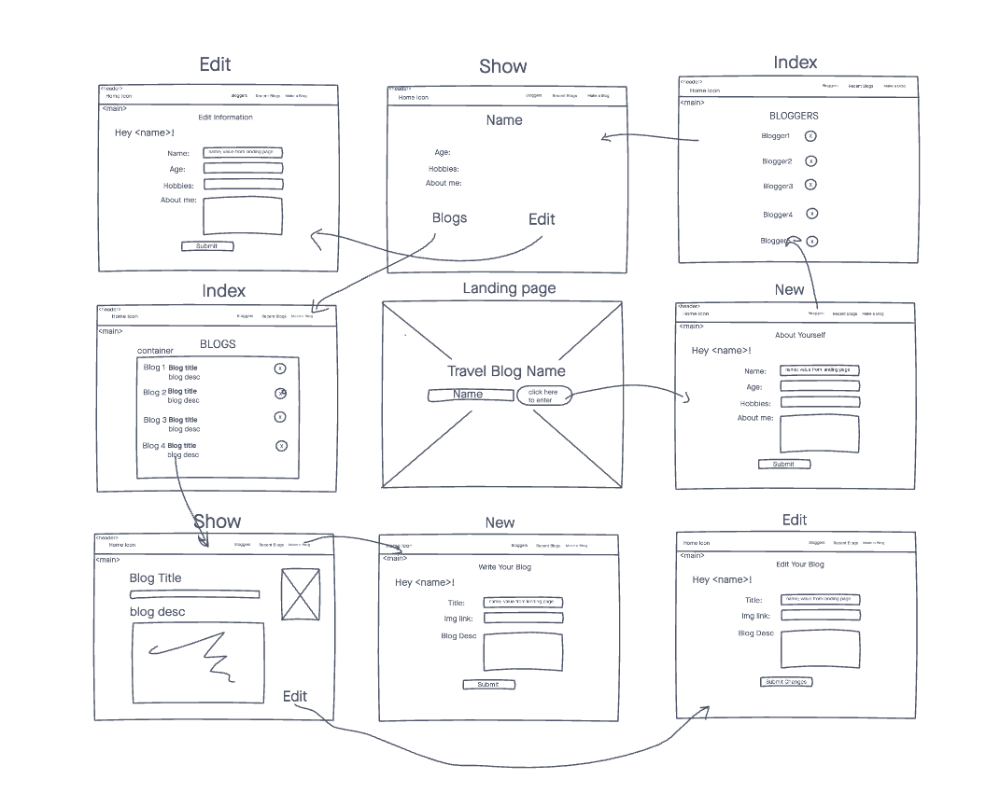
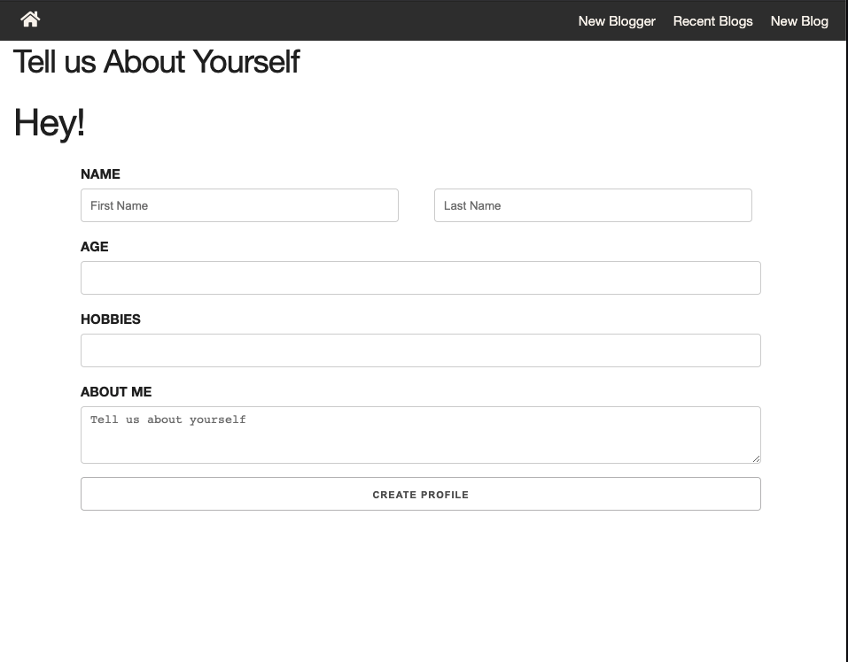
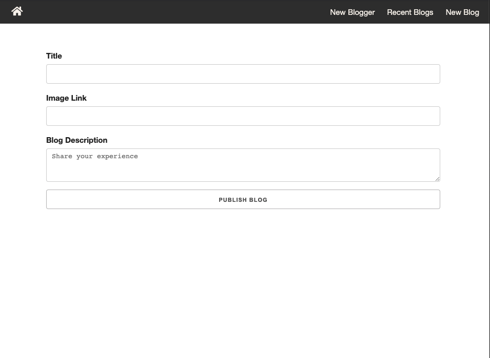
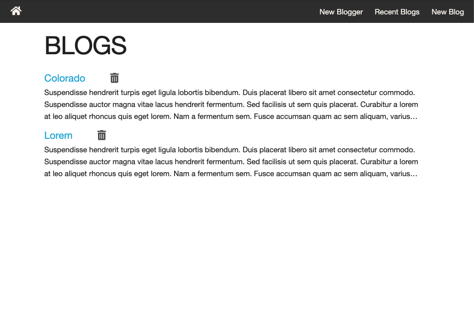

# TRAVEL BLOG

A simple Travel Blog to share your travel experience.

## Technologies Used
- HTML5
- CSS3
- JavaScript
- Express
- GitHub
- Heroku

## WireFrame

## Screenshots

## Future Enhancements
- Upload Pictures instead of img links
- Ability to use webcam to take picture
- Add geolocation for the blogs

## Website
https://vishakh-kumar.github.io/travel-log/